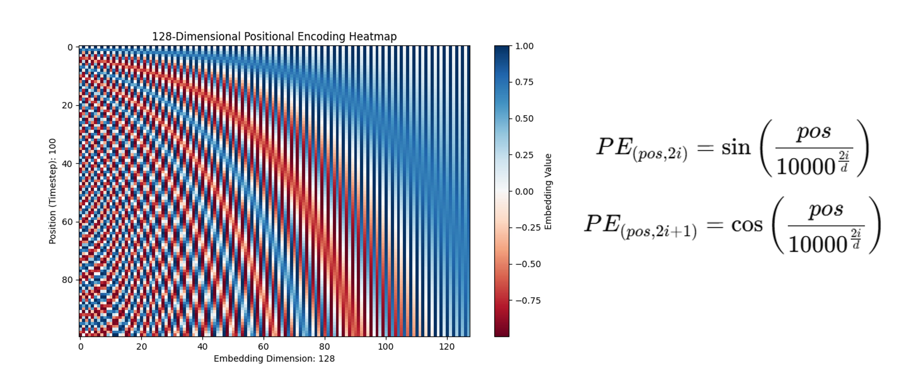
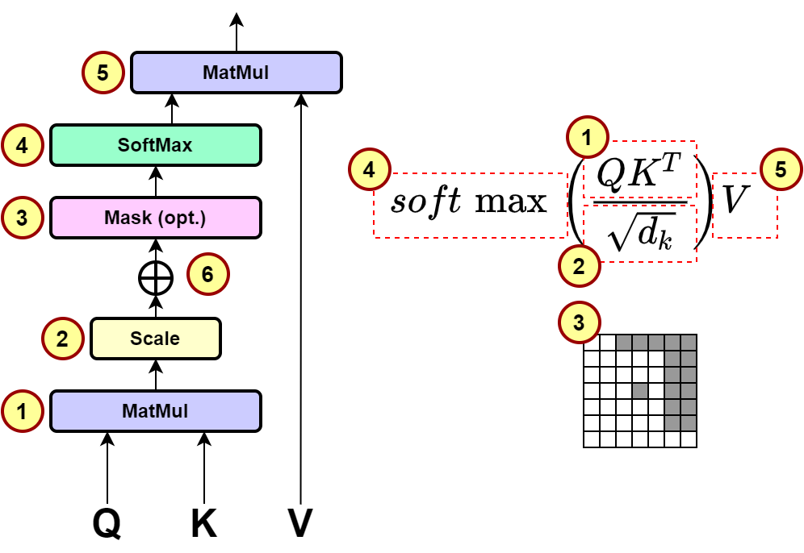
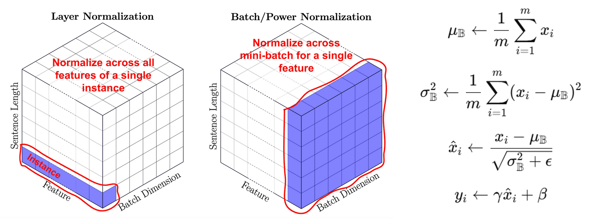
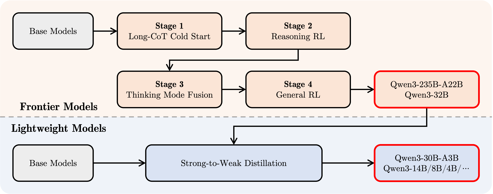
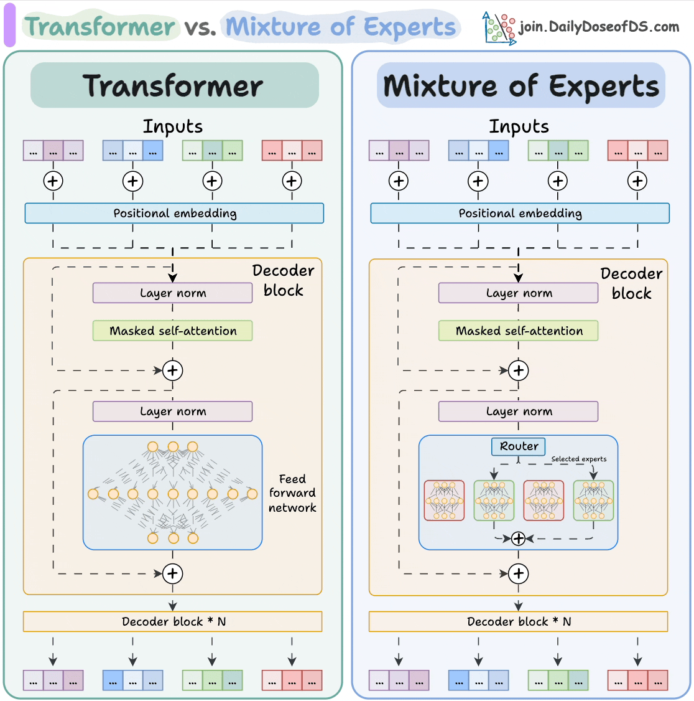
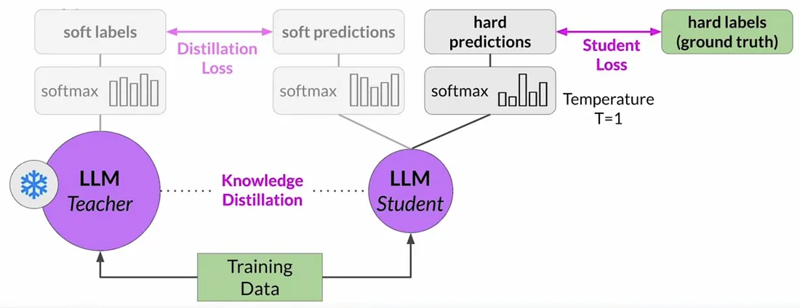
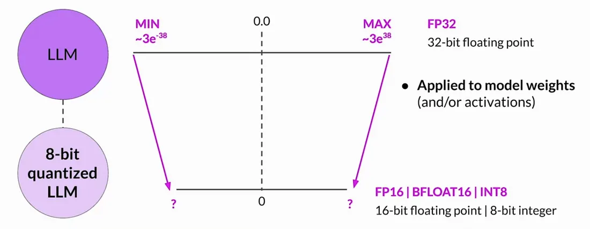

# Project Description

Build transformer-based LLMs from scratch — from core components (embedding, attention, etc.) to full GPT/LLaMA models. Includes training pipelines, compression, and efficiency techniques.

## Table of Contents

- [Transformer from scratch](#transformer-from-scratch)
  - [1. Positional Encoding](#1-positional-encoding)
  - [2. Transformer Embedding](#2-transformer-embedding)
  - [3. Multi-Head Attention](#3-multi-head-attention)
  - [4. Scale Dot Product Attention](#4-scale-dot-product-attention)
  - [5. Layer Norm](#5-layer-norm)
  - [6. Feed Forward](#6-feed-forward)
  - [7. Encoder & Decoder Structure](#7-encoder--decoder-structure)
- [GPT → LLaMA2 → LLaMA3 → LLaMA3.1 → LLaMA3.2 from scratch](#gpt--llama2--llama3--llama31--llama32-from-scratch)
- [Qwen 3 four stages training pipeline](#qwen-3-four-stages-training-pipeline)
- [Mixture-of-Experts (MoE)](#mixture-of-experts-moe)
- [Model Compression](#model-compression)
  - [Distillation](#distillation)
  - [Post-Training Quantization](#post-training-quantization)
  - [Pruning](#pruning)
- [Efficient Training for Large Language Models (LLMs)](#efficient-training-for-large-language-models-llms)
  - [Estimating GPU Memory Usage During Training](#estimating-gpu-memory-usage-during-training)
  - [Memory Optimization Techniques](#memory-optimization-techniques)
  - [Multi-GPU Training Strategies](#multi-gpu-training-strategies)
  - [FlashAttention & Liger Kernel](#flashattention--liger-kernel)
- [Key RL Methods for LLMs](#key-rl-methods-for-llms)
- [Prompting](#prompting)

# Transformer from scratch
My implementation Transformer model (Attention is All You Need - Google Brain, 2017)
<br><br>

<br><br>

## 1. Positional Encoding


    
```python
class PositionalEncoding(nn.Module):
    """
    compute sinusoid encoding.
    """
    def __init__(self, d_model, max_len, device):
        """
        constructor of sinusoid encoding class

        :param d_model: dimension of model
        :param max_len: max sequence length
        :param device: hardware device setting
        """
        super(PositionalEncoding, self).__init__()

        # same size with input matrix (for adding with input matrix)
        self.encoding = torch.zeros(max_len, d_model, device=device)
        self.encoding.requires_grad = False  # we don't need to compute gradient

        pos = torch.arange(0, max_len, device=device)
        pos = pos.float().unsqueeze(dim=1)
        # 1D => 2D unsqueeze to represent word's position

        _2i = torch.arange(0, d_model, step=2, device=device).float()
        # 'i' means index of d_model (e.g. embedding size = 50, 'i' = [0,50])
        # "step=2" means 'i' multiplied with two (same with 2 * i)

        self.encoding[:, 0::2] = torch.sin(pos / (10000 ** (_2i / d_model)))
        self.encoding[:, 1::2] = torch.cos(pos / (10000 ** (_2i / d_model)))
        # compute positional encoding to consider positional information of words

    def forward(self, x):
        # self.encoding
        # [max_len = 512, d_model = 512]

        batch_size, seq_len = x.size()
        # [batch_size = 128, seq_len = 30]

        return self.encoding[:seq_len, :]
        # [seq_len = 30, d_model = 512]
        # it will add with tok_emb : [128, 30, 512]         
```
<br><br>

## 2. Transformer Embedding


    
```python
class TransformerEmbedding(nn.Module):
    """
    token embedding + positional encoding (sinusoid)
    positional encoding can give positional information to network
    """

    def __init__(self, vocab_size, d_model, max_len, drop_prob, device):
        """
        class for word embedding that included positional information

        :param vocab_size: size of vocabulary
        :param d_model: dimensions of model
        """
        super(TransformerEmbedding, self).__init__()
        self.tok_emb = TokenEmbedding(vocab_size, d_model)
        self.pos_emb = PositionalEncoding(d_model, max_len, device)
        self.drop_out = nn.Dropout(p=drop_prob)

    def forward(self, x):
        tok_emb = self.tok_emb(x)
        pos_emb = self.pos_emb(x)
        return self.drop_out(tok_emb + pos_emb)         
```
<br><br>

## 3. Multi-Head Attention


```python
class MultiHeadAttention(nn.Module):

    def __init__(self, d_model, n_head):
        super(MultiHeadAttention, self).__init__()
        self.n_head = n_head
        self.attention = ScaleDotProductAttention()
        self.w_q = nn.Linear(d_model, d_model)
        self.w_k = nn.Linear(d_model, d_model)
        self.w_v = nn.Linear(d_model, d_model)
        self.w_concat = nn.Linear(d_model, d_model)

    def forward(self, q, k, v, mask=None):
        # 1. dot product with weight matrices
        q, k, v = self.w_q(q), self.w_k(k), self.w_v(v)

        # 2. split tensor by number of heads
        q, k, v = self.split(q), self.split(k), self.split(v)

        # 3. do scale dot product to compute similarity
        out, attention = self.attention(q, k, v, mask=mask)
        
        # 4. concat and pass to linear layer
        out = self.concat(out)
        out = self.w_concat(out)

        # 5. visualize attention map
        # TODO : we should implement visualization

        return out

    def split(self, tensor):
        """
        split tensor by number of head

        :param tensor: [batch_size, length, d_model]
        :return: [batch_size, head, length, d_tensor]
        """
        batch_size, length, d_model = tensor.size()

        d_tensor = d_model // self.n_head
        tensor = tensor.view(batch_size, length, self.n_head, d_tensor).transpose(1, 2)
        # it is similar with group convolution (split by number of heads)

        return tensor

    def concat(self, tensor):
        """
        inverse function of self.split(tensor : torch.Tensor)

        :param tensor: [batch_size, head, length, d_tensor]
        :return: [batch_size, length, d_model]
        """
        batch_size, head, length, d_tensor = tensor.size()
        d_model = head * d_tensor

        tensor = tensor.transpose(1, 2).contiguous().view(batch_size, length, d_model)
        return tensor
```
<br><br>

## 4. Scale Dot Product Attention



```python
class ScaleDotProductAttention(nn.Module):
    """
    compute scale dot product attention

    Query : given sentence that we focused on (decoder)
    Key : every sentence to check relationship with Qeury(encoder)
    Value : every sentence same with Key (encoder)
    """

    def __init__(self):
        super(ScaleDotProductAttention, self).__init__()
        self.softmax = nn.Softmax(dim=-1)

    def forward(self, q, k, v, mask=None, e=1e-12):
        # input is 4 dimension tensor
        # [batch_size, head, length, d_tensor]
        batch_size, head, length, d_tensor = k.size()

        # 1. dot product Query with Key^T to compute similarity
        k_t = k.transpose(2, 3)  # transpose
        score = (q @ k_t) / math.sqrt(d_tensor)  # scaled dot product

        # 2. apply masking (opt)
        if mask is not None:
            score = score.masked_fill(mask == 0, -10000)

        # 3. pass them softmax to make [0, 1] range
        score = self.softmax(score)

        # 4. multiply with Value
        v = score @ v

        return v, score
```
<br><br>

## 5. Layer Norm




```python
class LayerNorm(nn.Module):
    def __init__(self, d_model, eps=1e-12):
        super(LayerNorm, self).__init__()
        self.gamma = nn.Parameter(torch.ones(d_model))
        self.beta = nn.Parameter(torch.zeros(d_model))
        self.eps = eps

    def forward(self, x):
        mean = x.mean(-1, keepdim=True)
        var = x.var(-1, unbiased=False, keepdim=True)
        # '-1' means last dimension. 

        out = (x - mean) / torch.sqrt(var + self.eps)
        out = self.gamma * out + self.beta
        return out

```
<br><br>

## 6. Feed Forward


    
```python

class PositionwiseFeedForward(nn.Module):

    def __init__(self, d_model, hidden, drop_prob=0.1):
        super(PositionwiseFeedForward, self).__init__()
        self.linear1 = nn.Linear(d_model, hidden)
        self.linear2 = nn.Linear(hidden, d_model)
        self.relu = nn.ReLU()
        self.dropout = nn.Dropout(p=drop_prob)

    def forward(self, x):
        x = self.linear1(x)
        x = self.relu(x)
        x = self.dropout(x)
        x = self.linear2(x)
        return x
```
<br><br>

## 7. Encoder & Decoder Structure


```python
class EncoderLayer(nn.Module):

    def __init__(self, d_model, ffn_hidden, n_head, drop_prob):
        super(EncoderLayer, self).__init__()
        self.attention = MultiHeadAttention(d_model=d_model, n_head=n_head)
        self.norm1 = LayerNorm(d_model=d_model)
        self.dropout1 = nn.Dropout(p=drop_prob)

        self.ffn = PositionwiseFeedForward(d_model=d_model, hidden=ffn_hidden, drop_prob=drop_prob)
        self.norm2 = LayerNorm(d_model=d_model)
        self.dropout2 = nn.Dropout(p=drop_prob)

    def forward(self, x, src_mask):
        # 1. compute self attention
        _x = x
        x = self.attention(q=x, k=x, v=x, mask=src_mask)
        
        # 2. add and norm
        x = self.dropout1(x)
        x = self.norm1(x + _x)
        
        # 3. positionwise feed forward network
        _x = x
        x = self.ffn(x)
      
        # 4. add and norm
        x = self.dropout2(x)
        x = self.norm2(x + _x)
        return x
```
<br>

```python
class Encoder(nn.Module):

    def __init__(self, enc_voc_size, max_len, d_model, ffn_hidden, n_head, n_layers, drop_prob, device):
        super().__init__()
        self.emb = TransformerEmbedding(d_model=d_model,
                                        max_len=max_len,
                                        vocab_size=enc_voc_size,
                                        drop_prob=drop_prob,
                                        device=device)

        self.layers = nn.ModuleList([EncoderLayer(d_model=d_model,
                                                  ffn_hidden=ffn_hidden,
                                                  n_head=n_head,
                                                  drop_prob=drop_prob)
                                     for _ in range(n_layers)])

    def forward(self, x, src_mask):
        x = self.emb(x)

        for layer in self.layers:
            x = layer(x, src_mask)

        return x
```
<br>

```python
class DecoderLayer(nn.Module):

    def __init__(self, d_model, ffn_hidden, n_head, drop_prob):
        super(DecoderLayer, self).__init__()
        self.self_attention = MultiHeadAttention(d_model=d_model, n_head=n_head)
        self.norm1 = LayerNorm(d_model=d_model)
        self.dropout1 = nn.Dropout(p=drop_prob)

        self.enc_dec_attention = MultiHeadAttention(d_model=d_model, n_head=n_head)
        self.norm2 = LayerNorm(d_model=d_model)
        self.dropout2 = nn.Dropout(p=drop_prob)

        self.ffn = PositionwiseFeedForward(d_model=d_model, hidden=ffn_hidden, drop_prob=drop_prob)
        self.norm3 = LayerNorm(d_model=d_model)
        self.dropout3 = nn.Dropout(p=drop_prob)

    def forward(self, dec, enc, trg_mask, src_mask):    
        # 1. compute self attention
        _x = dec
        x = self.self_attention(q=dec, k=dec, v=dec, mask=trg_mask)
        
        # 2. add and norm
        x = self.dropout1(x)
        x = self.norm1(x + _x)

        if enc is not None:
            # 3. compute encoder - decoder attention
            _x = x
            x = self.enc_dec_attention(q=x, k=enc, v=enc, mask=src_mask)
            
            # 4. add and norm
            x = self.dropout2(x)
            x = self.norm2(x + _x)

        # 5. positionwise feed forward network
        _x = x
        x = self.ffn(x)
        
        # 6. add and norm
        x = self.dropout3(x)
        x = self.norm3(x + _x)
        return x
```
<br>

```python        
class Decoder(nn.Module):
    def __init__(self, dec_voc_size, max_len, d_model, ffn_hidden, n_head, n_layers, drop_prob, device):
        super().__init__()
        self.emb = TransformerEmbedding(d_model=d_model,
                                        drop_prob=drop_prob,
                                        max_len=max_len,
                                        vocab_size=dec_voc_size,
                                        device=device)

        self.layers = nn.ModuleList([DecoderLayer(d_model=d_model,
                                                  ffn_hidden=ffn_hidden,
                                                  n_head=n_head,
                                                  drop_prob=drop_prob)
                                     for _ in range(n_layers)])

        self.linear = nn.Linear(d_model, dec_voc_size)

    def forward(self, trg, src, trg_mask, src_mask):
        trg = self.emb(trg)

        for layer in self.layers:
            trg = layer(trg, src, trg_mask, src_mask)

        # pass to LM head
        output = self.linear(trg)
        return output
```
<br><br>

# GPT -> Llama2 -> Llama3 -> Llama3.1 -> Llama3.2 from scratch

This project includes my own implementation of GPT and LLaMA 3.2, along with a step-by-step transition from GPT to LLaMA 3.2 through intermediate architectures.


There are a total of 4 notebooks:

There are a total of 4 notebooks:

1. **[gpt-from-scratch.ipynb](gpt_llama2_llama3_llama3.1_llama3.2_from_scratch/gpt-from-scratch.ipynb)** – A standalone implementation of the GPT model.  
2. **[llama3.2-from-scratch.ipynb](gpt_llama2_llama3_llama3.1_llama3.2_from_scratch/llama3.2-from-scratch.ipynb)** – A standalone implementation of the LLaMA 3.2 architecture.  
3. **[convert_gpt_to_llama2.ipynb](gpt_llama2_llama3_llama3.1_llama3.2_from_scratch/convert_gpt_to_llama2.ipynb)** – A step-by-step conversion from GPT to LLaMA 2.  
4. **[convert_llama2_to_llama3_3.2.ipynb](gpt_llama2_llama3_llama3.1_llama3.2_from_scratch/convert-llama2-to-llama3.ipynb)** – A progressive transformation from LLaMA 2 to LLaMA 3, then to LLaMA 3.1, and finally to LLaMA 3.2.

This work is meant to help understand how transformer architectures evolve and which components are updated at each stage.

# Qwen 3 four stages training pipeline



# Mixture-of-Experts (MoE)

Further Reading on Mixture of Experts (MoE)

- 🔗 [Mixture of Experts (MoE): Scaling Language Models Efficiently](https://huggingface.co/blog/moe)  
 


# Model Compression

Further Reading on Model Compression

- 🔗 [LLM Optimization Strategies: Trimming, Transferring, and Tailoring for Efficient Deployment](https://ai.plainenglish.io/llm-optimization-strategies-trimming-transferring-and-tailoring-for-efficient-deployment-c74480419fc6)  

- 🔗 [LLM Pruning and Distillation: The MiniTron Approach](https://www.superannotate.com/blog/llm-pruning-distillation-minitron-approach)  
  

## Distillation



## Post-Training Quantization



## Pruning


# Efficient Training for Large Language Models (LLMs)

## Estimating GPU Memory Usage During Training

Total GPU memory ≈  
`Model parameters + Gradients + Optimizer states + Activations`

### Example: Training a 7B model using BF16 (2 bytes per param)

- **Model size**:  
  `7B params × 2 bytes = 14 GB`

- **Optimizer states (AdamW)**:  
  `2x model size = 28 GB`

- **Gradients**:  
  `1x model size = 14 GB`

- **Activations** (approximation):  
  Given:
  - Batch size (B) = 8
  - Sequence length (L) = 2048
  - Hidden size (H) = 4096
  - Layers (N) = 32  
  → `Activation ≈ 2 × B × L × H × N × 2 bytes ≈ ~4 GB`

- **Total VRAM**:  
  `14 + 28 + 14 + 4 = 60 GB`

These values may vary based on implementation details.

---

## Memory Optimization Techniques

| Technique                  | Description |
|----------------------------|-------------|
| **BF16 / FP16 precision**  | Reduces parameter size by half (2 bytes instead of 4) |
| **Gradient checkpointing** | Saves memory by recomputing activations during the backward pass |
| **LoRA**                   | Fine-tune low-rank adapter layers instead of full model weights |
| **8-bit AdamW**            | Reduces optimizer state memory |
| **GaLore**                 | Projects gradients into a low-rank space |
| **Quantization (INT8/4-bit)** | Compresses model weights and activations to 8-bit or lower for QLoRA-style fine-tuning |

## Multi-GPU Training Strategies

| Strategy                  | Description |
|---------------------------|-------------|
| **Data Parallelism (DDP)** | Replicates the model on each GPU and splits input data across them. Gradients are averaged across devices. Efficient and widely supported (via `torch.nn.parallel.DistributedDataParallel`). |
| **Tensor Parallelism**     | Splits individual layers (e.g., linear layers) across GPUs. Useful for very large models where a single GPU cannot hold the full model. |
| **Pipeline Parallelism**   | Splits the model into chunks (stages) and assigns each to a different GPU. Each stage processes a different minibatch in parallel (like a pipeline). |
| **ZeRO (Zero Redundancy Optimizer)** | From DeepSpeed. Optimizes memory by sharding optimizer states, gradients, and parameters across GPUs. Has three stages: ZeRO-1, ZeRO-2, ZeRO-3. |
| **FSDP (Fully Sharded Data Parallel)** | PyTorch-native alternative to ZeRO. Shards model weights, gradients, and optimizer states across devices. Highly memory-efficient. |
| **Model Parallelism (Manual)** | You manually assign layers to specific GPUs. Requires careful coordination of forward/backward passes and is error-prone. |
| **Hybrid Parallelism**     | Combines multiple techniques like DDP + Pipeline + Tensor Parallel. Used in large-scale training (e.g., LLaMA, GPT-4 training setups). |

## FlashAttention & Liger Kernel

### FlashAttention
- Fast, memory-efficient attention using optimized CUDA kernels.
- Speeds up attention layers and reduces GPU memory.
- Great for long sequences in transformers.
- Used in libraries like Hugging Face; requires Ampere+ GPU.

### Liger Kernel
- Fused CUDA kernel combining matrix multiplication and activation (GELU/Silu).
- Reduces kernel launches, speeds up transformer feedforward layers by ~1.2x–1.5x.
- Used in large model training frameworks like Megatron-DeepSpeed.

# Key RL Methods for LLMs

| Method | Description | Notes |
|--------|-------------|-------|
| **GRPO** | A simpler and more efficient RL algorithm than PPO, does not require a critic model. | DeepSeek R1 used GRPO. |
| **RLHF** | Trains LLMs using human feedback as a reward signal. | Traditional method widely used in practice. |
| **PPO** | A policy gradient algorithm with clipped objective to stabilize training. | Commonly used in RLHF but more complex than GRPO. |
| **DPO** | Directly optimizes with preference data, avoiding the complexity of RL. | A simpler alternative to PPO-based RLHF gaining traction. |

# Prompting

Reference: [Prompt Engineering Guide](https://www.promptingguide.ai/en)

[Back to Top](#table-of-contents)